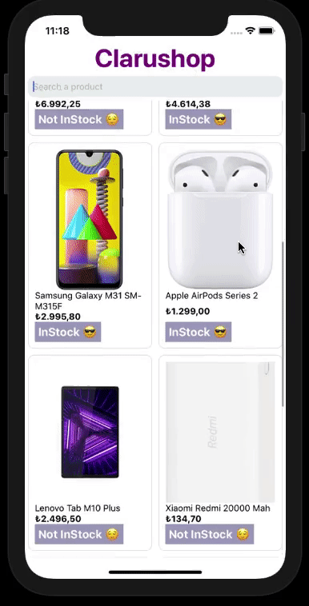

<h1 align="center">Shopping App</h1>


## Table of Contents

- [Overview](#overview)
- [Built With](#built-with)
- [How to use](#how-to-use)
- [Acknowledgements](#acknowledgements)
- [Contact](#contact)

<!-- OVERVIEW -->

## Overview

<!--  -->


### Built With


- HTML
- CSS
- [React](https://reactjs.org/)
- [React-Native](https://reactnative.dev/)


## How To Use


To clone and run this application, you'll need [Git](https://git-scm.com) and [Node.js](https://nodejs.org/en/download/) (which comes with [npm](http://npmjs.com)) installed on your computer. From your command line:

```bash

$ git clonehttps://github.com/Meltem-Karaagac/Shopping_project_ReactNative


$ npm install

$ npx react-native run-ios

```


## Acknowledgements


- [Node.js](https://nodejs.org/)

## Contact

- GitHub [Meltem-Karaagac](https://github.com/Meltem-Karaagac)
- Linkedin [meltem-karaagac](https://www.linkedin.com/in/meltem-karaagac/)

